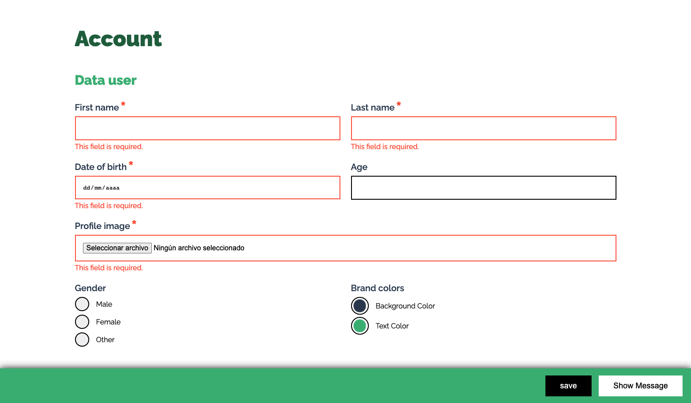

# Validation form



## 🎯 Description

This repository serves as a complete example of a form with different types of fields, including required validations and custom text fields.

The components are meticulously structured, following the `BEM` (Block Element Modifier) and `ITCSS` (Inverted Triangle CSS) architecture, ensuring easy maintenance and scalability as the project grows.

Integrating client-side `JS` validations enhances the user experience by providing real-time feedback as they interact with form fields.

Whether you want to improve your form building skills or are looking for organizational inspiration, these components provide an excellent starting point. They provide a valuable reference for other web development projects, provide a solid `CSS` class structure, powerful client-side `JS` validations, and unique custom elements.

The best part is that you can easily customize these components to fit your specific project requirements, making them adaptable and valuable for various web development endeavors.

## 🏗️ Developed with


[](https://jonassebastianohlsson.com/specificity-graph/)
[](https://sass-lang.com/)
[](https://en.bem.info/methodology/)
[](https://www.xfive.co/blog/itcss-scalable-maintainable-css-architecture/#tips-on-using-itcss)
[](https://csswizardry.com/2015/08/bemit-taking-the-bem-naming-convention-a-step-further/)

[](https://jquery.com/)
[](https://jqueryvalidation.org/)
[](https://ckeditor.com/ckeditor-4/)

[](https://github.com/nvm-sh/nvm)
[](https://nodejs.org/es/)
[](https://docs.npmjs.com/)
[](https://gulpjs.com)
[](https://www.npmjs.com/package/autoprefixer)
[](https://babeljs.io/)
[](https://icomoon.io/app/#/select)

This project is developed inside of `src` folder, using in `HTML`, `CSS` (with the `SASS` preprocessor) and `JS` (with the `Jquery` library).
To streamline the build process, the project utilizes the `Gulp` task runner, which compiles and optimizes the files, placing them in the `dist` folder.
Once everything is ready, the project is published using an `NPM` script in the `gh-page` branch on GitHub.

Here are the main technologies and tools used in this project:

### Javascript

<details>
	<summary>
		<a href="https://jquery.com/">
			JQuery 3.4.1
		</a>
	</summary>
	<div>
		<p>
			jQuery is a fast, small, and feature-rich <code>JavaScript</code> library. It makes things like <code>HTML</code> document traversal and manipulation, event handling, animation, and <code>Ajax</code> much simpler with an easy-to-use API that works across a multitude of browsers.
		</p>
	</div>
</details>

<details>
	<summary>
		<a href="https://jqueryvalidation.org/">
			jQuery Validation 1.19.1
		</a>
	</summary>
	<div>
		<p>
			This jQuery plugin makes simple clientside form validation easy, whilst still offering plenty of customization options. It makes a good choice if you’re building something new from scratch, but also when you’re trying to integrate something into an existing application with lots of existing markup. The plugin comes bundled with a useful set of validation methods, including URL and email validation, while providing an API to write your own methods. All bundled methods come with default error messages in english and translations into 37 other languages.
		</p>
		<p>
			Some more methods are provided as add-ons, and are currently included in <code>additional-methods.min.js</code> in the download package. You can find the source code for all additional methods in the <a href="https://github.com/jquery-validation/jquery-validation/tree/master/src/additional">GitHub repository</a>.
		</p>
	</div>
</details>

<details>
	<summary>
		<a href="https://ckeditor.com/ckeditor-4/">
			CKEditor 4
		</a>
	</summary>
	<div>
		<p>
			Modern <code>JavaScript</code> rich text editor with a modular architecture. Its clean UI and features provide the perfect WYSIWYG UX ❤️ for creating semantic content. It is full of features like pasting from Word, Excel and Google Docs. It's excellent table support with column resizing, row and column selection. You can include multimedia embeds as insert images, videos, tweets, Instagram posts widgets, code snippets, mathematical formulas and more. It has spreadsheets to create data grids within the editor. It uses autocomplete, @mentions, emoji 😊, styling and formatting plugins (copy formatting feature). It is designed with inline and iframe UI, autogrow, maximize mode for distraction-free typing with the read-only mode ...and more!
		</p>
		<p>
			Here you can see the <a href="https://github.com/beatrizsmerino/validation-form/blob/master/src/js/libs/ckeditor/README.md">README.md</a> file of this project and the <a href="https://github.com/beatrizsmerino/validation-form/tree/master/src/js/libs/ckeditor/samples">samples</a> folder.
		</p>
	</div>
</details>

### Gulp

As mentioned above, this project makes use of the `Gulp` task runner. The [gulpfile.js](https://github.com/beatrizsmerino/validation-form/blob/master/gulpfile.js) file contains several `Gulp` tasks designed to:

-   Compile and compress `SASS` and `JS` files.
-   Copy and paste `HTML` files and `ICOMOON` icon fonts.
-   Create a server and enable live reloading using [Browsersync + Gulp.js](https://browsersync.io/docs/gulp).

So project development takes place in the `src` and the final optimized content is generated in the `dist` folder for publishing. This setup ensures an efficient and organized workflow for web development.

## 🚀 Commands

<details>
	<summary>
		<h3>
			Install dependencies
		</h3>
	</summary>
	<div>
		To configure the project, after cloning this repository, you need to install the required NPM packages.
	</div>
</details>

```shell
npm install
```

<details>
	<summary>
		<h3>
			Deploy project
		</h3>
	</summary>
	<div>
		Once the development of the code in the <code>src</code> folder is finished, you can publish the project with the contents of the <code>dist</code> folder to Github Pages (<code>gh-pages</code> branch).
	</div>
</details>

```shell
npm run deploy
```

<details>
	<summary>
		<h3>
			Build files, run server and watch changes
		</h3>
	</summary>
	<div>
		<p>
			The default gulp task handles various tasks:
		</p>
		<ol>
			<li>
				Creates the <code>dist</code> folder if it does not exist.
			</li>
			<li>
				Build <code>html</code>, <code>css</code>, <code>js</code> and font icons of <code>icomoon</code> in the <code>dist</code> folder.
			</li>
			<li>
				Watch for changes inside the <code>src</code> folder to rebuild the files.
			</li>
			<li>
				Sets a server and reloads it automatically when changes are made to the <code>dist</code> folder.
			</li>
		</ol>
	</div>
</details>

```shell
gulp
```

<details>
	<summary>
		<h3>Create and run server</h3>
	</summary>
	<div>
		<p>
			This command is able to:
		</p>
		<ol>
			<li>
				Create a static server with the <code>browserSync</code> package.
			</li>
			<li>
				Serve the files in the <code>dist</code> folder.
			</li>
			<li>
				Open the default <code>index.html</code> file in any of these browsers: <code>Chrome</code> and <code>Firefox</code>.
			</li>
		</ol>
	</div>
</details>

```shell
gulp serve
```

<details>
	<summary>
		<h3>
			Watch for changes
		</h3>
	</summary>
	<div>
		<p>
			This command is a powerful tool that performs the following tasks:
		</p>
		<ol>
			<li>
				Create and launch a server.
			</li>
			<li>
				Observe the changes in the <code>html</code>, <code>sass</code>, <code>icomoon</code> and <code>js</code> files located inside the <code>src</code> folder.
			</li>
			<li>
				When a change occurs, runs the necessary tasks to re-generate the files inside the <code>dist</code> folder.
			</li>
			<li>
				Consequently, it reloads the server automatically, if there are any changes in the files inside the <code>dist</code> folder.
			</li>
		</ol>
		<p>
			This ensures a smooth development experience, as you can make changes to your source files and see updates in real time without manually refreshing the page.
		</p>
	</div>
</details>

```shell
gulp watch
```

<details>
	<summary>
		<h3>
			Build files
		</h3>
	</summary>
	<div>
		<p>
			This command is able to:
		</p>
		<ol>
			<li>
				Creates the <code>dist</code> folder if it does not exist.
			</li>
			<li>
				Build the <code>html</code>, <code>css</code>, <code>js</code> and <code>icomoon</code> on <code>dist</code> folder.
			</li>
		</ol>
	</div>
</details>

```shell
gulp build
```

<details>
	<summary>
		<h3>
			Build HTML files
		</h3>
	</summary>
	<div>
		<p>
			This command is able to:
		</p>
		<ol>
			<li>
				Creates the <code>dist</code> folder if it does not exist.
			</li>
			<li>
				Copies the <code>html</code> files from the <code>src</code> folder to the <code>dist</code> folder.
			</li>
		</ol>
	</div>
</details>

```shell
gulp html
```

<details>
	<summary>
		<h3>
			Build CSS files
		</h3>
	</summary>
	<div>
		<p>
			This command is able to:
		</p>
		<ol>
			<li>
				Creates the <code>dist</code> folder if it does not exist.
			</li>
			<li>
				Performs a series of processes:
				<ul>
					<li>
						Compiles the <code>styles.sass</code> file, including its imported partials located at <code>src/sass/</code>.
					</li>
					<li>
						Adds prefixes to <code>CSS</code>. properties for better browser compatibility.
					</li>
					<li>
						Compresses the <code>CSS</code>. file to reduce its size for optimized performance.
					</li>
					<li>
						Creates and adds a <code>mapping</code> for the debugger styles in the browser inspector for easier debugging.
					</li>
					<li>
						Applies a Gulp Plugin, <code>Line Ending Corrector</code>, to ensure consistent line endings in your <code>CSS</code>. files.
					</li>
				</ul>
			</li>
			<li>
				Export the <code>styles.min.css</code> file to <code>dist/css/</code> folder.
			</li>
		</ol>
	</div>
</details>

```shell
gulp css
```

<details>
	<summary>
		<h3>
			Build JS files
		</h3>
	</summary>
	<div>
		<p>
			This command is able to:
		</p>
		<ol>
			<li>
				Creates the <code>dist</code> folder if it does not exist.
			</li>
			<li>
				Copies files of <code>JS</code> libraries from <code>src/js/libs</code> and pastes them into <code>dist/js/libs</code> folder.
			</li>
			<li>
				Performs a series of processes:
				<ul>
					<li>
						Compile partials <code>JS</code> files partials located at <code>src/js/</code>.
					</li>
					<li>
						Use <code>Babel</code>, a JavaScript compiler, to ensure backward compatibility and compatibility with various browsers.
					</li>
					<li>
						Minifies the concatenated file, reducing its size for optimized performance.
					</li>
					<li>
						Applies a Gulp Plugin, <code>Line Ending Corrector</code>, to ensure consistent line endings in your <code>JS</code>. files.
					</li>
				</ul>
			</li>
			<li>
				Export the <code>scripts.min.js</code> file to <code>dist/js</code> folder.
			</li>
		</ol>
	</div>
</details>

```shell
gulp js
```

<details>
	<summary>
		<h3>
			Build icon files
		</h3>
	</summary>
	<div>
		<p>
			This project uses icons from <a href="https://icomoon.io/app/#/select">icomoon.io</a>, an online tool app that has 2 buttons to <code>generate SVG & More</code> and <code>generate Font</code>.
			</br>
			The <code>src/icomoon/</code> folder contains a mix of both downloaded folders.
		</p>
		<p>
			This command is able to:
		</p>
		<ol>
			<li>
				Creates the <code>dist</code> folder if it does not exist.
			</li>
			<li>
				Gets <code>style.css</code> file from <code>src/icomoon/</code> folder, generates a new compressed file, renames it <code>fonts.min.css</code> and export the file to <code>dist/icomoon</code>.
			</li>
			<li>
				Copy directory <code>src/icomoon/fonts</code>, containing the fonts (EOT, SVG, TTF, WOFF), and paste the files into <code>dist/icomoon/fonts</code>
			</li>
		</ol>
	</div>
</details>

```shell
gulp icon
```

## 🚧 State

There is still room for improvement in validation, such as the implementation of showing/hiding fields dynamically as the user fills/hides them... and many other potential areas.
