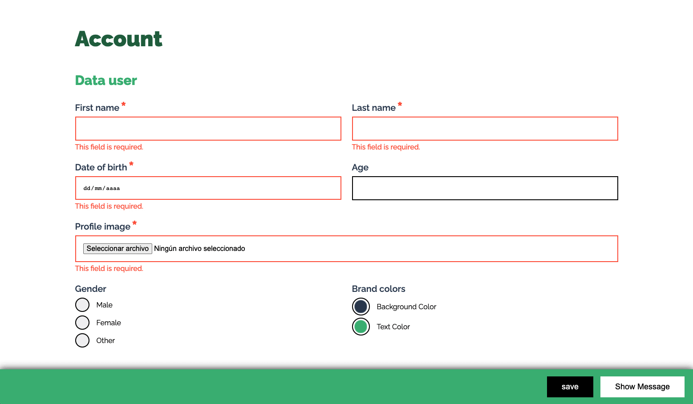

  


# Validation form



## 🎯 Description

This repository serves as a complete example of a form with different types of fields, including required validations and custom text fields.

The components are meticulously structured, following the `BEM` (Block Element Modifier) and `ITCSS` (Inverted Triangle CSS) architecture, ensuring easy maintenance and scalability as the project grows.

Integrating client-side `JS` validations enhances the user experience by providing real-time feedback as they interact with form fields.

Whether you want to improve your form building skills or are looking for organizational inspiration, these components provide an excellent starting point. They provide a valuable reference for other web development projects, provide a solid `CSS` class structure, powerful client-side `JS` validations, and unique custom elements.

The best part is that you can easily customize these components to fit your specific project requirements, making them adaptable and valuable for various web development endeavors.

## 🏗️ Developed with


[](https://jonassebastianohlsson.com/specificity-graph/)
[](https://sass-lang.com/)
[](https://en.bem.info/methodology/)
[](https://www.xfive.co/blog/itcss-scalable-maintainable-css-architecture/#tips-on-using-itcss)
[](https://csswizardry.com/2015/08/bemit-taking-the-bem-naming-convention-a-step-further/)

[](https://jquery.com/)
[](https://jqueryvalidation.org/)
[](https://ckeditor.com/ckeditor-4/)

[](https://github.com/nvm-sh/nvm)
[](https://nodejs.org/es/)
[](https://docs.npmjs.com/)
[](https://gulpjs.com)
[](https://www.npmjs.com/package/autoprefixer)
[](https://babeljs.io/)
[](https://icomoon.io/app/#/select)

This project is developed inside of `src` folder, using in `HTML`, `CSS` (with the `SASS` preprocessor) and `JS` (with the `Jquery` library).
To streamline the build process, the project utilizes the `Gulp` task runner, which compiles and optimizes the files, placing them in the `dist` folder.
Once everything is ready, the project is published using an `NPM` script in the `gh-page` branch on GitHub.

Here are the main technologies and tools used in this project:

### Javascript

<details>
	<summary>
		<a href="https://jquery.com/">
			JQuery 3.4.1
		</a>
	</summary>
	<div>
		<p>
			jQuery is a fast, small, and feature-rich <code>JavaScript</code> library. It makes things like <code>HTML</code> document traversal and manipulation, event handling, animation, and <code>Ajax</code> much simpler with an easy-to-use API that works across a multitude of browsers.
		</p>
	</div>
</details>

<details>
	<summary>
		<a href="https://jqueryvalidation.org/">
			jQuery Validation 1.19.1
		</a>
	</summary>
	<div>
		<p>
			This jQuery plugin makes simple clientside form validation easy, whilst still offering plenty of customization options. It makes a good choice if you’re building something new from scratch, but also when you’re trying to integrate something into an existing application with lots of existing markup. The plugin comes bundled with a useful set of validation methods, including URL and email validation, while providing an API to write your own methods. All bundled methods come with default error messages in english and translations into 37 other languages.
		</p>
		<p>
			Some more methods are provided as add-ons, and are currently included in <code>additional-methods.min.js</code> in the download package. You can find the source code for all additional methods in the <a href="https://github.com/jquery-validation/jquery-validation/tree/master/src/additional">GitHub repository</a>.
		</p>
	</div>
</details>

<details>
	<summary>
		<a href="https://ckeditor.com/ckeditor-4/">
			CKEditor 4
		</a>
	</summary>
	<div>
		<p>
			Modern <code>JavaScript</code> rich text editor with a modular architecture. Its clean UI and features provide the perfect WYSIWYG UX ❤️ for creating semantic content. It is full of features like pasting from Word, Excel and Google Docs. It's excellent table support with column resizing, row and column selection. You can include multimedia embeds as insert images, videos, tweets, Instagram posts widgets, code snippets, mathematical formulas and more. It has spreadsheets to create data grids within the editor. It uses autocomplete, @mentions, emoji 😊, styling and formatting plugins (copy formatting feature). It is designed with inline and iframe UI, autogrow, maximize mode for distraction-free typing with the read-only mode ...and more!
		</p>
		<p>
			Here you can see the <a href="https://github.com/beatrizsmerino/validation-form/blob/master/src/js/libs/ckeditor/README.md">README.md</a> file of this project and the <a href="https://github.com/beatrizsmerino/validation-form/tree/master/src/js/libs/ckeditor/samples">samples</a> folder.
		</p>
	</div>
</details>

### Gulp

As mentioned above, this project makes use of the `Gulp` task runner. The [gulpfile.js](https://github.com/beatrizsmerino/validation-form/blob/master/gulpfile.js) file contains several `Gulp` tasks designed to:

-   Compile and compress `SASS` and `JS` files.
-   Copy and paste `HTML` files and `ICOMOON` icon fonts.
-   Create a server and enable live reloading using [Browsersync + Gulp.js](https://browsersync.io/docs/gulp).

So project development takes place in the `src` and the final optimized content is generated in the `dist` folder for publishing. This setup ensures an efficient and organized workflow for web development.

## 🚀 Commands

### Install dependencies

Install all dependencies listed in `package.json`.

```bash
npm install
```

### Clean install dependencies

Remove `node_modules` and `package-lock.json` to reinstall from scratch.

```bash
npm run install:clean
```

### Lint after install

Runs automatically after `npm install` to run `npm run lint` on all project files.

```bash
npm run postinstall
```

### Set up Husky git hooks

Runs automatically after `postinstall` to enable `pre-commit` and `commit-msg` hooks of [Husky](https://typicode.github.io/husky/).

```bash
npm run prepare
```

### Lint all files

Run [Prettier](https://prettier.io/) (`prettier:fix`), [ESLint](https://eslint.org/) (`eslint:fix`) and [Stylelint](https://stylelint.io/) (`stylelint:fix`) to format and lint all project files.

```bash
npm run lint
```

### Deploy project

Publish the `dist` folder to GitHub Pages (`gh-pages` branch).

```bash
npm run deploy
```

### Build files, run server and watch changes

Build `html`, `css`, `js` and `icomoon` files, run a server and watch for changes.

```bash
gulp
```

### Create and run server

Create a static server with `browserSync` and serve the `dist` folder.

```bash
gulp serve
```

### Watch for changes

Watch for changes in `src` files, rebuild to `dist` and reload the server automatically.

```bash
gulp watch
```

### Build files

Build `html`, `css`, `js` and `icomoon` files to the `dist` folder.

```bash
gulp build
```

### Build HTML files

Copy `html` files from `src` to `dist` folder.

```bash
gulp html
```

### Build CSS files

Compile `sass`, add prefixes, compress and export `styles.min.css` to `dist/css/`.

```bash
gulp css
```

### Build JS files

Compile, transpile with `Babel`, minify and export `scripts.min.js` to `dist/js/`.

```bash
gulp js
```

### Build icon files

Compress `icomoon` CSS and copy font files from [icomoon.io](https://icomoon.io/app/#/select) to `dist/icomoon/`.

```bash
gulp icon
```

## 🚧 Status

There is still room for improvement in validation, such as the implementation of showing/hiding fields dynamically as the user fills/hides them... and many other potential areas.

## 📄 License

This project is licensed under the `MIT` License, which allows free use, modification and distribution. See [LICENSE](LICENSE) for details.
